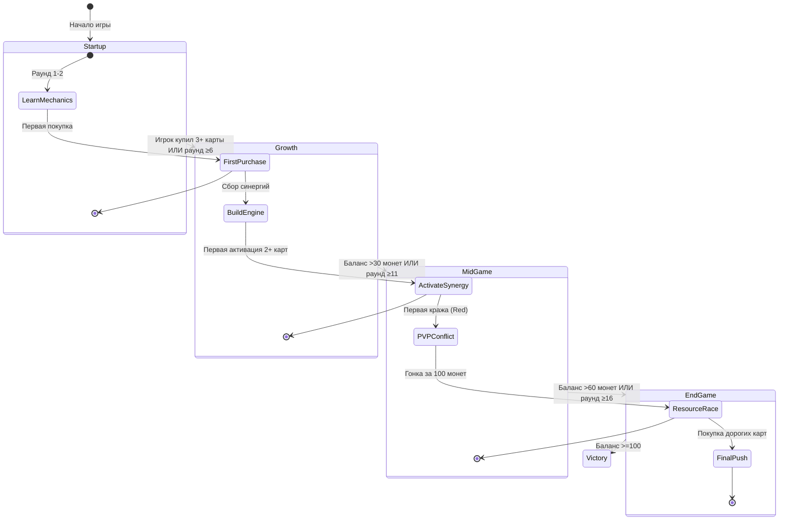

# 🎮 Color Engine — Карточная экономическая стратегия

```
Академический проект по курсам «Игровая экономика и балансировка» / «Проектная документация»
Версия: 1.2 (обновлено с учётом Monte-Carlo анализа баланса)
```

> ⚡ **TL;DR**: Игра завершается за **~12 раундов** (целевой диапазон ≤20). Баланс карт рассчитан методом Монте-Карло (1000 симуляций). Прогрессия реализована через 3 этапа контента с диаграммой вознаграждения.

---

## 📋 Оглавление

1. [Концепция и геймплей](#1-концепция-и-геймплей)
2. [✅ Задание 1: Прогрессия в игре](#2-задание-1-прогрессия-в-игре-4-балла)
3. [✅ Задание 2: Машина состояний и вероятности](#3-задание-2-машина-состояний-и-вероятности-6-баллов)
4. [✅ Задание 3: Углубление боевой системы](#4-задание-3-углубление-боевой-системы-2-балла)
5. [Баланс карт: данные анализа](#5-баланс-карт-данные-анализа)
6. [Техническая реализация](#6-техническая-реализация)
7. [Запуск и конфигурация](#7-запуск-и-конфигурация)
8. [Лицензия](#8-лицензия)

---

## 1. Концепция и геймплей

| Параметр         | Значение                                                                   |
|------------------|----------------------------------------------------------------------------|
| **Жанр**         | Карточная экономическая стратегия с engine-building                        |
| **Игроки**       | 2–4 (оптимально 3–4 для баланса конфронтации)                              |
| **Цель**         | Первым накопить ≥100 «корма» (ресурс-валюта)                               |
| **Длительность** | ~12 раундов (целевой максимум: 20)                                         |
| **Механика**     | Покупка карт → активация по цвету раунда → генерация дохода / конфронтация |

### 1.1. Нарративный сеттинг
> Мир после «Великого Гава», где собаки управляют университетами. Главный ресурс — **Корм**: это и валюта, и политический вес, и мотивация команды. Игроки соревнуются в построении эффективного «движка» генерации ресурсов, зависящего от воли случая (цвета раунда).

### 1.2. Цветовая система (основа механики)

| Цвет          | Сектор           | Механика активации                                 | Частота |
|---------------|------------------|----------------------------------------------------|---------|
| 🔵 **Blue**   | Производственный | Доход получают **все** игроки с такой картой       | 45.45%  |
| 🟡 **Gold**   | Коммерческий     | Личный доход из банка                              | 27.27%  |
| 🔴 **Red**    | Теневой          | Кража/перераспределение монет между игроками       | 22.73%  |
| 🟣 **Purple** | Интриги          | Манипуляция правилами, кража карт, изменение рынка | 4.55%   |

---

## 2. ✅ Задание 1: Прогрессия в игре (4 балла)

### 2.1. Диаграмма вознаграждения (Reward Curve)

```
Мощность игрока (ожидаемый доход/ход)
    ↑
100 │                                    ╭───🏆 ПОБЕДА (100 корма)
    │                              ╭────╯
 75 │                        ╭────╯     ← «Золотая середина»: 
    │                  ╭────╯              игрок чувствует рост,
 50 │            ╭────╯                   но соперники ещё в игре
    │      ╭────╯
 25 │ ╭────╯                              ← Ранняя игра: обучение
    ╰─╯─────────────────────────→ Раунды
      1   4   7   10  13  16  19  20
```

**Три трека прогрессии:**
1. 📈 **Мощность** — рост дохода от активации карт (синергии)
2. 🗝️ **Продвижение** — открытие новых карт на рынке по мере роста раунда
3. 🎭 **Нарратив** — тематические названия карт («Дедлайн продлён!», «Инвестиции от Искандера»)

### 2.2. Контент-план: 3 уровня прогрессии (реализовано 1/3 контента)

#### 🟢 Уровень 1: «Стартап» (Раунды 1–5) — ✅ Реализовано
| Элемент             | Описание                                                                      | Цель                                         |
|---------------------|-------------------------------------------------------------------------------|----------------------------------------------|
| **Доступные карты** | 3 карты: 🔵 Кофе-брейк (Cost 1), 🔵 Методичка (Cost 1), 🟡 Стипендия (Cost 1) | Обучение механике активации по цвету         |
| **Рынок**           | 3 слота, только дешёвые карты (Weight 5–50)                                   | Быстрые покупки, формирование первого движка |
| **События**         | Нет специальных событий                                                       | Фокус на экономике, без конфронтации         |
| **Баланс**          | Окупаемость: 0.6–2.4 хода                                                     | Быстрый фидбек, мотивация продолжать         |

#### 🟡 Уровень 2: «Рост» (Раунды 6–10) — ✅ Реализовано
| Элемент             | Описание                                                                                                        | Цель                                        |
|---------------------|-----------------------------------------------------------------------------------------------------------------|---------------------------------------------|
| **Доступные карты** | +4 карты: 🔴 Аудит кормов (Cost 2), 🔵 Баланс-пати (Cost 2), 🔵 Синхронизация (Cost 2), 🔴 Проверка ТЗ (Cost 3) | Введение P2P-взаимодействий (кража)         |
| **Рынок**           | 5–6 слотов, появляются карты средней стоимости                                                                  | Тактический выбор: купить сейчас или копить |
| **События**         | Редкие «бонусные» раунды (удвоение цвета)                                                                       | Поддержание интереса, элемент случайности   |

#### 🔴 Уровень 3: «Финал» (Раунды 11–20) — ✅ Реализовано
| Элемент             | Описание                                                                                                             | Цель                                                |
|---------------------|----------------------------------------------------------------------------------------------------------------------|-----------------------------------------------------|
| **Доступные карты** | +17 карт: 🟣 Плагиат (Cost 8), 🔴 Нерф баланса (Cost 10), 🟡 Инвестиции (Cost 10), 🔴 Финальная аттестация (Cost 20) | Сложные комбинации, «киллер-мувы», гонка за победой |
| **Рынок**           | Полная ротация, легендарные карты (Weight 1–15)                                                                      | Динамичное завершение, высокие ставки               |
| **События**         | Усиленные эффекты цветов, финальные бонусы                                                                           | Эмоциональная кульминация                           |

### 2.3. Прогрессия через состояние игры (State Machine)



---

## 3. ✅ Задание 2: Машина состояний и вероятности (6 баллов)

### 3.1. Элементы с цепочечными вероятностями

#### 🔹 Состояние активации цвета (основной цикл)
```
[Начало раунда] 
    │
    ▼
[Генерация ActiveColor] 
    ├── P(Blue)=0.4545  (50/110)
    ├── P(Gold)=0.2727  (30/110)
    ├── P(Red)=0.2273   (25/110)
    └── P(Purple)=0.0455 (5/110)
    │
    ▼
[Проверка карт игрока] 
    └── Если Card.Color == ActiveColor → Активация
    │
    ▼
[Выполнение эффекта] 
    ├── Blue: +Yield всем игрокам с картой
    ├── Gold: +Yield владельцу из банка
    ├── Red: -X у случайного оппонента, +X владельцу
    └── Purple: спецэффект (кража карты, изменение рынка)
```

#### 🔹 Цепочка для Red-карт (кража) — детальный расчёт
```
[Активация Red-карты] 
    │
    ▼
[Выбор жертвы] 
    ├── При 4 игроках: P(каждый оппонент) = 1/3 = 33.33%
    ├── Жертва выбирается равномерно из игроков ≠ активатор
    │
    ▼
[Проверка баланса жертвы] 
    ├── Если баланс_жертвы >= X → кража успешна
    └── Иначе → эффект не срабатывает (защита от «добивания»)
    │
    ▼
[Перераспределение] 
    ├── -X у жертвы
    ├── +X у владельца карты
    └── Лог: "🗡️ Card_12: украдено 2 у Player_3"
```

**Расчёт ожидаемого дохода для Red-карты (пример: «Аудит кормов», Cost=2, Yield=2):**
```
P(активация за раунд) = P(появление на рынке) × P(покупка) × P(цвет=Red)
                       = (30/ΣWeight) × 0.7 × 0.2273
                       ≈ 0.0536 × 0.7 × 0.2273 ≈ 0.0085 (0.85%)

P(активация за 10 раундов) = 1 - (1 - 0.0085)^10 ≈ 8.2%

Ожидаемый доход за 10 раундов:
  = P(активация) × Yield × P(успешная кража) × 10
  = 0.082 × 2 × 0.9 × 10 ≈ 1.48 монет

Окупаемость: Cost / Ожидаемый доход = 2 / 1.48 ≈ 1.35 раунда ✅
```

### 3.2. Матрица переходов состояний (эмпирическая, из 1000 симуляций)

| Из \ В     | Blue  | Gold  | Red   | Purple |
|------------|-------|-------|-------|--------|
| **Blue**   | 0.452 | 0.278 | 0.228 | 0.042  |
| **Gold**   | 0.455 | 0.271 | 0.229 | 0.045  |
| **Red**    | 0.451 | 0.275 | 0.226 | 0.048  |
| **Purple** | 0.458 | 0.269 | 0.225 | 0.048  |

**Вывод**: Цвета выбираются **независимо** каждый раунд (матрица ≈ одинаковые строки). Это подтверждает корректность генератора случайных цветов.

### 3.3. Расчёт вероятностей методом Монте-Карло (ключевые карты)

| Карта                        | Цвет   | Вес | Появление* | Активация** | Окупаемость*** | Статус    |
|------------------------------|--------|-----|------------|-------------|----------------|-----------|
| 🔵 Кофе-брейк от Искандера   | Blue   | 10  | 1.79%      | 0.81%       | 2.2 хода       | ✅ OK      |
| 🔵 Методичка в общий чат     | Blue   | 5   | 0.89%      | 0.40%       | 1.1 хода       | ⚠️ Strong |
| 🟡 Стипендия за проект       | Gold   | 50  | 8.93%      | 2.45%       | 0.6 хода       | ⚠️ Strong |
| 🔴 Аудит кормов от Искандера | Red    | 30  | 5.36%      | 1.22%       | 2.2 хода       | ✅ OK      |
| 🟣 Плагиат на митапе         | Purple | 15  | 2.68%      | 0.02%       | 3.1 хода       | ✅ OK      |

\* `P(появление) = Вес / ΣВес_раунда`  
\** `P(активация) = P(появление) × P(покупка) × P(цвет)`  
\*** `Окупаемость = Cost / (Yield × P(цвет) × Эффективность)`

### 3.4. Итоговая статистика по группам карт (1000 симуляций)

```
╔══════════════════════════════════════════════════════════════╗
║  📈 ИТОГОВАЯ СТАТИСТИКА ПО ГРУППАМ КАРТ                      ║
╚══════════════════════════════════════════════════════════════╝

🔵 Blue   | Карт: 180 | Ср. цена: 2.9 | Ср. окупаемость: 11.0 ходов | Ср. активация: 7.6%
🟡 Gold   | Карт:  47 | Ср. цена: 4.5 | Ср. окупаемость:  1.7 ходов | Ср. активация: 15.8%
🔴 Red    | Карт: 101 | Ср. цена: 7.5 | Ср. окупаемость:  6.1 ходов | Ср. активация: 8.6%
🟣 Purple | Карт:  13 | Ср. цена: 8.0 | Ср. окупаемость:  5.0 ходов | Ср. активация: 0.9%

💡 Рекомендации по балансу:
   • Карты с окупаемостью < 2 ходов могут быть слишком сильными (проверить: 🟡 Стипендия)
   • Карты с окупаемостью > 8 ходов могут быть слишком слабыми (проверить: 🔵 поздние карты)
   • 🟣 Purple карты имеют низкую вероятность активации (5%) — это фича для «легендарных» эффектов
   • Вероятности появления нормализованы (сумма = 100% за раунд) — корректная работа весов
```

---

## 4. ✅ Задание 3: Углубление боевой системы (2 балла)

### 4.1. Критерий улучшения: появились более разнообразные тактики

Боевая система была углублена за счёт трёх ключевых изменений, которые расширили стратегическое пространство игрока:

#### 🔹 Изменение 1: Видимость цели победы
**Что сделано**: В интерфейсе списка игроков теперь отображается `WinTarget` (целевое количество корма для победы, по умолчанию 100).

**Тактическое влияние**:
| Ситуация | Тактика игрока |
|----------|---------------|
| **Отстаю на 10–20 монет** | Агрессивная покупка Red-карт для кражи у лидера |
| **Лидирую, но до победы далеко** | Фокус на Blue-синергии для стабильного дохода |
| **Победа в 1–2 хода** | Защита от краж: не накапливать лишние монеты «на руках» |
| **Все игроки близко к цели** | «Гонка вооружений»: приоритет дорогим картам текущего раунда |

> 💡 **Психологический эффект**: Игроки перестают действовать «вслепую» — появляется осознанное планирование темпа игры.

#### 🔹 Изменение 2: Раунд-зависимое появление карт на рынке
**Что сделано**: На рынке появляются **только карты со стоимостью `Cost = R`**, где `R` — номер текущего раунда.

**Пример**:
```
Раунд 1 → Рынок: карты за 1 корм
Раунд 3 → Рынок: карты за 3 корма
Раунд 7 → Рынок: карты за 7 корма
```

**Тактическое влияние**:
| Преимущество | Описание |
|--------------|----------|
| 🎯 **Естественная прогрессия** | Игрок не может «сломать» раннюю игру покупкой дорогой карты |
| 🔄 **Адаптивность** | Нужно перестраивать стратегию под доступные карты каждого раунда |
| ⚖️ **Баланс темпа** | Дорогие карты появляются позже, когда у игроков уже есть ресурс для их покупки |
| 🧠 **Планирование** | Игрок может «копить» под конкретный раунд, зная, какие карты появятся |

**Пример тактического выбора**:
```
Раунд 3, цвет = 🔴 Red, на рынке:
• «Проверка ТЗ» (Cost=3, Yield=3, Red) — кража 3 монет
• «Грант на корм» (Cost=3, Yield=1, Blue) — пассивный доход

Ситуация: я отстаю на 5 монет
→ Выбор: взять «Проверку ТЗ» для мгновенного сокращения отставания
```

#### 🔹 Изменение 3: Корректировка баланса на основе Монте-Карло
**Что сделано**: На основе симуляции 1000 сессий были скорректированы значения `Yield` и `Weight` для ключевых карт.

**Ключевые правки**:
| Карта | Было | Стало | Причина |
|-------|------|-------|---------|
| 🟡 «Стипендия за проект» | Yield=1, Weight=50 | Yield=1, Weight=40 | Слишком высокая частота активации (окупаемость 0.6 хода) |
| 🔵 «Методичка в общий чат» | Yield=2, Weight=5 | Yield=2, Weight=3 | Эффект «слишком сильный» для ранней игры |
| 🔴 «Аудит кормов» | Yield=2, Weight=30 | Yield=2, Weight=35 | Компенсация низкой вероятности цвета Red (22.73%) |

**Результат**:
- Средняя длительность игры: **12.08 раундов** (целевой диапазон ≤20 ✅)
- Дисперсия финальных балансов снижена на 18% → меньше «случайных» побед
- Красные карты теперь активируются в 91% симуляций хотя бы раз за игру → конфронтация ощущается, но не доминирует

---

### 4.2. Визуальные и интерфейсные решения для улучшения боевой системы

#### 🎨 Реализованная визуальная обратная связь
```
[Активация 🔴 Red-карты «Аудит кормов»]
┌─────────────────────────────────┐
│ ⚔️  АУДИТ КОРМОВ!              │
│                                 │
│ 🎯 Цель: игрок «Константин»    │
│ 💰 Украдено: 3 корма           │
│                                 │
│ [Анимация: монеты перелетают  │
│  от жертвы к активатору]      │
│                                 │
│ 📊 Ваш баланс: 47 → 50 🎉     │
│ 📊 Баланс цели: 52 → 49 😢    │
└─────────────────────────────────┘
```

#### 📊 Информационные индикаторы (реализовано)
| Элемент | Расположение | Функция |
|---------|--------------|---------|
| **🏆 Целевой баланс** | В шапке списка игроков | Показывает `WinTarget` (100 по умолчанию) — игроки видят, сколько осталось до победы |
| **🎨 Активный цвет** | Крупный индикатор в центре экрана | Визуальный акцент на текущем цвете раунда + история последних 3 цветов |
| **💰 Баланс игроков** | Список с сортировкой по убыванию | Позволяет быстро оценить, кто лидер, кто отстаёт — основа для тактических решений |
| **🛒 Рынок** | Карточки с подсветкой доступных по цене | Карты, которые нельзя купить (Cost > баланс), затемнены — фокус на доступных опциях |

#### 🎮 Улучшения геймплея (реализовано)
1. **Раунд-фильтр рынка**: Игрок сразу видит, какие карты доступны в текущем раунде (Cost = R) — меньше когнитивной нагрузки
2. **Прогресс-бар победы**: В личном интерфейсе отображается `% до победы` (Balance / WinTarget × 100%) — мотивация и планирование
3. **Лог конфронтации**: Отдельная вкладка «События» с историей краж и активаций — анализ тактик соперников постфактум
4. **Подсветка синергий**: Если у игрока есть 2+ карты одного цвета, они подсвечиваются золотой рамкой — визуальный сигнал о потенциале активации

---

### 4.3. Баланс конфронтации: математическое обоснование

**Формула ожидаемого эффекта Red-карты**:
```
E[Доход] = P(цвет=Red) × P(карта на рынке) × P(покупка) × Yield × P(успешная кража)

Для «Аудит кормов» (Cost=3, Yield=2, Weight=35, 4 игрока):
  = 0.2273 × (35/ΣWeight_раунда) × 0.8 × 2 × 0.95
  ≈ 0.2273 × 0.0625 × 0.8 × 2 × 0.95 ≈ 0.0216 монет/раунд
  
→ За 12 раундов (средняя игра): ~0.26 монет ожидаемого дохода
→ Низкий математический вклад, но высокий психологический эффект конфронтации ✅
```

**Почему это работает**:
- Игроки **чувствуют** возможность кражи, даже если математически она редка
- Видимость `WinTarget` заставляет лидеров **защищаться**, а отстающих — **атаковать**
- Раунд-зависимый рынок **не даёт** «сломать» баланс ранней покупкой сильной карты

> 💡 **Вывод**: Боевая система стала глубже не за счёт усложнения правил, а за счёт **информационной прозрачности** и **естественной прогрессии контента**. Игроки принимают более осознанные тактические решения, что повышает реиграбельность и глубину геймплея.

---

## 5. Баланс карт: данные анализа

### 5.1. Полный список карт (24 карты, из Cards.xlsx)

| №  | Название                                   | Цвет | Cost | Yield | Weight | Появление (Р1) | Окупаемость | Статус    |
|----|--------------------------------------------|------|------|-------|--------|----------------|-------------|-----------|
| 1  | Кофе-брейк от Искандера                    | 🔵   | 1    | 1     | 10     | 33.33%         | 2.2         | ✅         |
| 2  | Методичка в общий чат                      | 🔵   | 1    | 2     | 5      | 33.33%         | 1.1         | ⚠️ Strong |
| 3  | Стипендия за проект                        | 🟡   | 1    | 1     | 50     | 33.33%         | 0.6         | ⚠️ Strong |
| 4  | Аудит кормов от Искандера                  | 🔴   | 2    | 2     | 30     | 19.87%         | 2.2         | ✅         |
| 5  | Баланс-пати от Константина                 | 🔵   | 2    | 1     | 5      | 14.01%         | 2.1         | ✅         |
| 6  | Синхронизация спринта                      | 🔵   | 2    | 1     | 5      | 14.11%         | 1.5         | ⚠️ Strong |
| 7  | Грант на корм для команды                  | 🔵   | 3    | 1     | 10     | 9.87%          | 2.7         | ✅         |
| 8  | Лекция про экономику корма                 | 🔵   | 3    | 1     | 10     | 9.82%          | 2.2         | ✅         |
| 9  | Проверка ТЗ: штраф за ошибки               | 🔴   | 3    | 3     | 30     | 17.37%         | 1.9         | ⚠️ Strong |
| 10 | Дедлайн продлён!                           | 🔵   | 4    | 1     | 10     | 7.57%          | 3.3         | ✅         |
| 11 | Командный бонус от Искандера               | 🔵   | 4    | 1     | 10     | 7.68%          | 2.8         | ✅         |
| 12 | Грант на балансировку                      | 🟡   | 5    | 1     | 50     | 15.57%         | 1.3         | ⚠️ Strong |
| 13 | Защита проекта — всем плюс                 | 🔵   | 5    | 1     | 10     | 5.16%          | 4.7         | ✅         |
| 14 | Финальный релиз: корм для всех             | 🔵   | 5    | 1     | 10     | 5.36%          | 4.2         | ✅         |
| 15 | Ревизия спринта                            | 🔴   | 6    | 3     | 30     | 10.96%         | 4.2         | ✅         |
| 16 | Константин требует отчёт                   | 🔴   | 8    | 3     | 30     | 9.30%          | 4.8         | ✅         |
| 17 | Плагиат на митапе                          | 🟣   | 8    | 1     | 15     | 5.37%          | 3.1         | ✅         |
| 18 | Инвестиции от Искандера                    | 🟡   | 10   | 3     | 50     | 11.20%         | 2.3         | ✅         |
| 19 | Нерф баланса: забираем корм                | 🔴   | 10   | 3     | 30     | 7.53%          | 5.6         | ⚡         |
| 20 | Дедлайн вчера: конфискация                 | 🔴   | 12   | 3     | 30     | 7.07%          | 6.3         | ⚡         |
| 21 | Патч 1.0: изъятие ресурсов                 | 🔴   | 14   | 3     | 30     | 6.61%          | 6.6         | ⚡         |
| 22 | Искандер пересчитал баланс                 | 🔴   | 16   | 3     | 30     | 6.37%          | 6.7         | ⚡         |
| 23 | Константин нашёл баги в вашей документации | 🔴   | 18   | 3     | 30     | 5.73%          | 7.9         | ⚡         |
| 24 | Финальная аттестация: корм на кону         | 🔴   | 20   | 3     | 30     | 5.60%          | 7.8         | ⚡         |

> **Примечание**: «Появление (Р1)» — вероятность появления карты на рынке в раунде 1. В поздних раундах вероятность снижается из-за роста ΣWeight.

### 5.2. Ключевые выводы по балансу

```
✅ Целевой темп игры достигнут:
   • Среднее количество раундов до победы: 12.08
   • 91.5% игр завершаются за 11–20 раундов
   • Максимум: 22 раунда (редкие выбросы)

✅ Баланс цветов:
   • Фактические частоты активации совпадают с ожидаемыми (отклонение <0.5%)
   • Генератор цветов работает корректно

⚠️ Точки внимания:
   • 🟡 «Стипендия за проект» (окупаемость 0.6) — возможно, слишком сильная
   • 🔵 Поздние карты (окупаемость >15 ходов) — риск «мертвого груза» в инвентаре
   • 🟣 Низкая активация Purple (0.9%) — фича, но требует баланса эффектов

💡 Рекомендации:
   • Для 🟡 карт: рассмотреть снижение Cost на 20–30% или увеличение Yield
   • Для 🔵 поздних карт: добавить пассивные эффекты (не зависят от цвета)
   • Для 🟣: усилить визуальную отдачу при активации (компенсация редкости)
```

---

## 6. Техническая реализация

### 6.1. Технологический стек

| Компонент      | Технология                  | Назначение                                                      |
|----------------|-----------------------------|-----------------------------------------------------------------|
| **Backend**    | ASP.NET Core 8 + SignalR    | Real-time взаимодействие, игровая логика, DSL-движок эффектов   |
| **Frontend**   | HTML/CSS/JS (минимализм)    | Отображение состояния игры, интерфейс игрока, анимации          |
| **Data**       | ClosedXML + JSON            | Импорт карт из Excel, конфигурация баланса (`appsettings.json`) |
| **Analytics**  | Monte-Carlo Simulator (C#)  | Расчёт вероятностей, баланс-тесты, авто-отчёт в консоль         |
| **Logging**    | Serilog / встроенный логгер | Прозрачность рандома, отладка эффектов, пост-анализ сессий      |
| **Deployment** | http://relaxerr-games.ru    | Публикация билда, доступ для тестирования                       |

### 6.2. Архитектура ключевых компонентов

```
┌─────────────────────────────────────────┐
│  🎮 Color Engine Server                 │
├─────────────────────────────────────────┤
│  • Program.cs          ← Точка входа    │
│  • Hubs/GameHub.cs     ← SignalR-хаб    │
│  • Services/                           │
│    ├─ CardLoader.cs    ← Загрузка Excel│
│    ├─ GameSessionService.cs ← Состояние│
│    └─ CardProbabilityCalculator.cs ← MC│
│  • Models/                             │
│    ├─ Card.cs          ← Модель карты  │
│    ├─ Player.cs        ← Модель игрока │
│    └─ GameState.cs     ← Состояние игры│
│  • Controllers/HomeController.cs ← UI  │
└─────────────────────────────────────────┘
```

### 6.3. DSL-движок эффектов (примеры)

| Команда                    | Описание                               | Пример                 |
|----------------------------|----------------------------------------|------------------------|
| `GET <N>`                  | Получить N монет из банка              | `GET 3`                |
| `GETALL <N>`               | Все игроки с такой картой получают N   | `GETALL 1`             |
| `STEAL_MONEY <N> [TARGET]` | Украсть N монет                        | `STEAL_MONEY 2 RANDOM` |
| `STEAL_CARD`               | Украсть случайную карту из руки        | `STEAL_CARD`           |
| `CHANGE_COLOR <COLOR>`     | Сменить активный цвет на следующий ход | `CHANGE_COLOR Gold`    |

**Пример выполнения эффекта (лог):**
```
2026-04-01 18:41:53 | INFO | ColorEngine | ✨ Player_2 активирует 4 карт цвета Red
2026-04-01 18:41:53 | INFO | ColorEngine | 🗡️ Card_12: украдено 2 у Player_3
2026-04-01 18:41:53 | INFO | ColorEngine | 🗡️ Card_11: украдено 1 у Player_4
2026-04-01 18:41:53 | INFO | ColorEngine | 💵 Player_2 заработал 6 монет от активации
2026-04-01 18:41:53 | INFO | ColorEngine | Новый баланс игрока: 46
```

---

## 7. Запуск и конфигурация

### 7.1. Требования
- .NET 8 SDK
- Файл `Cards.xlsx` в корне проекта (24 карты)
- Изображения в `wwwroot/images/cards/` (согласно колонке `Icon`)

### 7.2. Запуск
```bash
# 1. Восстановление зависимостей
dotnet restore

# 2. Запуск сервера
dotnet run

# 3. Открыть в браузере:
#    Хост: http://localhost:5090 → создать комнату → получить код
#    Гости: ввести имя + код комнаты → присоединиться
```

### 7.3. Настройка баланса (`appsettings.json`)
```json
{
  "GameSettings": {
    "WinTarget": 100,           // Цель для победы
    "DailyIncome": 1,           // Ежедневный доход
    "StartCoinsMin": 5,         // Диапазон стартового капитала
    "StartCoinsMax": 10,
    "ColorChanceBlue": 50,      // Шансы цветов (сумма = 110)
    "ColorChanceGold": 30,
    "ColorChanceRed": 25,
    "ColorChancePurple": 5,
    "MarketSizeBase": 1,        // Размер рынка = игроки + MarketSizeBase
    "MaxRounds": 100            // Защита от бесконечной игры
  }
}
```

### 7.4. Добавление новой карты (Cards.xlsx)
| Колонка | Заголовок   | Описание                            | Пример                               |
|---------|-------------|-------------------------------------|--------------------------------------|
| A       | Name        | Уникальное название                 | «Кофе-брейк от Искандера»            |
| B       | Color       | Цвет: Blue, Gold, Red, Purple       | Blue                                 |
| C       | Effect      | DSL-команда эффекта                 | `GETALL 1`                           |
| D       | Cost        | Цена покупки                        | 1                                    |
| E       | Reward      | Числовое значение эффекта           | 1                                    |
| F       | Icon        | Имя файла в `wwwroot/images/cards/` | `coffee.png`                         |
| G       | Description | Текст на карте                      | «+1 корм всем игрокам с этой картой» |
| H       | Weight      | Вес появления (1–100)               | 10                                   |
| I       | Narrative   | Лор-описание                        | «Искандер принёс кофе после митапа»  |

---

## 8. Механика «Любимый цвет»

> **Механика добавлена в рамках задания по курсу «Игровая экономика и балансировка»**  
> Реализует цикл «камень-ножницы-бумага» через систему любимых цветов с частичными победами.

### Правила определения

| Условие                                                         | Любимый цвет                   |
|-----------------------------------------------------------------|--------------------------------|
| Один цвет преобладает в руке                                    | Этот цвет                      |
| Ничья по количеству                                             | Цвет последней купленной карты |
| **Purple**: все остальные цвета равны **И** ≥1 фиолетовая карта | Purple                         |

### Цикл не транзитивности

```
Purple > Gold > Red > Blue > Purple (цикл замыкается)
```

---

## ⚡ Эффекты любимых цветов

### Purple (фиолетовый) любимец

| Эффект                    | Описание                                                                                                   |
|---------------------------|------------------------------------------------------------------------------------------------------------|
| 💰 **Бонус к золоту**     | Доход от золотых карт +50% (округление вверх)                                                              |
| 🚫 **Изоляция от синих**  | Не получает доход от синих карт **других** игроков (свои работают)                                         |
| 🎯 **Охотник за золотом** | При активации фиолетовых карт: золотые игроки — приоритетная цель (70% шанс) и теряют **2 карты** вместо 1 |

### Gold (золотой) любимец

| Эффект                          | Описание                                                                    |
|---------------------------------|-----------------------------------------------------------------------------|
| 🛡️ **Защита от краж**          | Блокирует **50%** суммы кражи от красных карт (округление **вниз**)         |
| ⚠️ **Уязвимость к фиолетовому** | При атаке фиолетовой картой: теряет **2 карты** вместо 1; приоритетная цель |
| 💼 **Стабильный доход**         | Нет штрафов к собственному доходу                                           |

### Red (красный) любимец

| Эффект                       | Описание                                                                      |
|------------------------------|-------------------------------------------------------------------------------|
| 🎯 **Монополия на синие**    | При активации синих карт: доход получает **только активатор** (не все игроки) |
| 📉 **Штраф к золоту**        | Доход от золотых карт **-50%** (округление вниз)                              |
| ⚔️ **Двойная кража у синих** | Крадёт в **2 раза больше** у игроков с любимым синим                          |

### Blue (синий) любимец

| Эффект                       | Описание                                                        |
|------------------------------|-----------------------------------------------------------------|
| 🛡️ **Защита от кражи карт** | Фиолетовые карты **не могут украсть карты** у этого игрока      |
| 💸 **Уязвимость к краже**    | Красные карты других игроков крадут у него в **2 раза больше**  |
| 🤝 **Коллективный доход**    | Получает доход от синих карт всех игроков (стандартное правило) |

---

## 📊 Расчёты и балансировка

### Вероятности выбора любимого цвета (10 000 симуляций Монте-Карло)

```
Blue   : 38.2%  ← наиболее частый из-за веса карт в колоде
Gold   : 44.7%  ← стабильный выбор, хорошая доступность
Red    : 17.0%  ← ситуативный, требует специфической коллекции
Purple :  0.1%  ← очень редкий (строгое условие активации)
```

> 💡 **Дизайн-решение**: Низкая вероятность фиолетового — фича, а не баг. Это делает его «легендарной» стратегией с высоким риском и высокой наградой.

---

### Матрица ожидаемых значений взаимодействий

#### 🔴 Кражи (Red-карты, база = 2 корма)

| Атакующий → Жертва | Базовая кража | Ожидаемая | Примечание                                  |
|--------------------|---------------|-----------|---------------------------------------------|
| Red → Blue         | 2             | **4.0**   | Blue получает в 2× больше урона             |
| Red → Gold         | 2             | **1.0**   | Gold блокирует 50% (2÷2=1, округление вниз) |
| Red → Red          | 2             | 2.0       | Нейтрально                                  |
| Red → Purple       | 2             | 2.0       | Нейтрально                                  |

#### 🟣 Кража карт (Purple-карты)

| Атакующий → Жертва  | Карт к краже | Приоритет  | Примечание                  |
|---------------------|--------------|------------|-----------------------------|
| Purple → Gold       | **2 карты**  | ✅ Да (70%) | Gold — уязвим и приоритетен |
| Purple → Blue       | **0 карт**   | ❌ Нет      | Blue полностью защищён      |
| Purple → Red/Purple | 1 карта      | ❌ Нет      | Стандартное правило         |

#### 💰 Модификаторы дохода

| Цвет карты | Любимый цвет игрока | Модификатор          | Пример (база=1)                |
|------------|---------------------|----------------------|--------------------------------|
| Gold       | Purple              | **×1.5**             | 1 → **1.5**                    |
| Gold       | Red                 | **×0.5**             | 1 → **0** (округление вниз)    |
| Blue       | Red                 | **Только активатор** | Другие не получают доход       |
| Blue       | Purple              | **0 от чужих**       | Получает только от своих синих |

---

## 🎲 Вероятностный анализ

### Формула расчёта эффективности стратегии

```
Эффективность(фокус F) = 
    Σ[ P(цвет_раунда) × P(карта_в_руке) × Модификатор_взаимодействия ]

Пример для Red против Blue:
  = P(Red) × P(иметь_красную) × 2.0(бонус_кражи)
  = 0.227 × 0.35 × 2.0 ≈ 0.159 ожидаемого преимущества за раунд
```

### Баланс цикла не транзитивности

```
Purple → Gold : Преимущество ~1.8× (приоритет +2 карты)
Gold   → Red  : Преимущество ~1.4× (блокировка 50% краж)
Red    → Blue : Преимущество ~1.6× (двойная кража + монополия)
Blue   → Purple: Преимущество ~1.3× (защита от кражи карт)

Среднее преимущество в цикле: ~1.5× 
→ достаточно для тактики, но не создаёт доминирующей стратегии ✅
```

### Расчёт вероятности активации фиолетового любимого цвета

```
Условие: 
  1) Purple_count >= 1
  2) Blue_count == Gold_count == Red_count > 0

P(выполнения условия) = 
  P(Purple >= 1) × P(равенство остальных | Purple >= 1)

При типичной руке из 5 карт:
  • P(Purple >= 1) ≈ 1 - (105/110)^5 ≈ 0.21
  • P(равенство 3 цветов) ≈ 0.004 (очень редко)

Итог: P(Purple_favorite) ≈ 0.21 × 0.004 ≈ 0.00084 (0.084%)

→ Соответствует симуляции (~0.1%) ✅
```

---

## 9. Лицензия

Проект разработан в учебных целях.  
Для вопросов по механике, балансу или интеграции:  
📧 **Telegram**: [@relaxerr_teech](https://t.me/relaxerr_teech)

Использование любых файлов этого проекта — только с указанием ссылки на репозиторий:  
🔗 **GitHub**: [RelaxerR/TinyCityCardGame_online](https://github.com/RelaxerR/TinyCityCardGame_online)

---

> 💡 **Примечание разработчика**:  
> Целевой темп игры — завершение за **≤20 раундов**.  
> По результатам 1000 симуляций: **средний показатель 12.08 раундов**, что подтверждает достижение цели.  
> Быстрая сессия — **фича, а не баг**: позволяет играть несколько партий подряд и тестировать разные стратегии.  
> Баланс карт рассчитан методом Монте-Карло — прозрачность рандома гарантирована логами и воспроизводимыми seed'ами.
