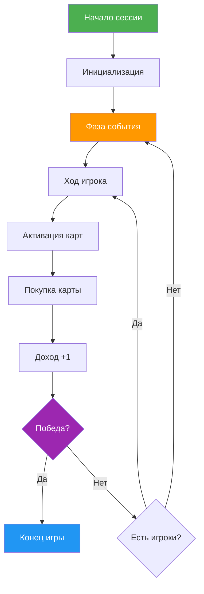

# Прототип карточной экономической игры «Color Engine»

## Описание

`Данный проект разрабатывается в рамках академических курсов (Курсы «Игровая экономика и балансировка игр», «Проектная документация»).
Основной упор сделан на математическую модель, расчет темпа игры и окупаемости карт (ROI), а не на визуальную составляющую.
Система спроектирована как гибко настраиваемая через внешние конфигурационные файлы.`
---

## 📋 Оглавление

1. [Концепция](#-концепция)
2. [Core Loop (Блок-схема)](#-core-loop-блок-схема)
3. [Математика и баланс](#-математика-и-баланс)
4. [Механики и правила](#-механики-и-правила)
5. [Карты и эффекты](#-карты-и-эффекты)
6. [Конфигурация](#-конфигурация)
7. [Запуск прототипа](#-запуск-прототипа)
8. [Технологический стек](#-технологический-стек)
9. [Лицензия](#-лицензия)

---
## 📝 Концепция

**Жанр**: Карточная экономическая стратегия с элементами engine-building<br>
**Вдохновение**: «Колонизаторы», «Мачи Коро», «7 Чудес»<br>
**Игроки**: 2–4<br>
**Цель**: Первым накопить ≥ WinTarget монет (по умолчанию: 100)<br>

Настольная карточная стратегия, вдохновленная механиками «Колонизаторов», «Мачи Коро», «7 чудес». Игроки соревнуются в эффективности построения «движка» генерации ресурсов, зависящего от воли случая (броска кубика или выбора случайного цвета).
Ключевая особенность: прозрачность рандома и балансировка через логирование всех событий системы.

### Нарративное описание
`Мир после «Великого Гава», где собаки правят городами. Главный ресурс — Корм (гранулы): это и валюта, и политический вес. Игроки соревнуются в эффективности построения «движка» генерации ресурсов, зависящего от воли случая.`

### ⚙️ Основные механики

* **Цель игры**: Первым накопить количество монет, равное или превышающее WinTarget.
* **Сессия**: Локальное лобби или комната на 2–4 игроков.
* **Рынок**: На столе всегда доступно N+1 открытых карт (где N — количество игроков).

### 🔄 Алгоритм функционирования

#### 4.1. Фаза события (Начало круга)

1. **Ротация очередности**: Порядок ходов пересчитывается — первым ходит игрок с наименьшим количеством монет (механика балансировки лидеров).
2. **Обновление рынка**: На столе пополняются карты до N+1 на основе параметров Weight из конфигурации карт.
3. **Генерация события**: Система случайно определяет ActiveColor (1 из 4) на текущий круг. Результат фиксируется в логе.

#### 4.2. Игровой цикл (Ход игрока)



1. Фаза активации: Если Card.Color == ActiveColor, игрок активирует эффект карты согласно DSL-скрипту.
2. Фаза покупки: Игрок может приобрести 1 карту с рынка, если Balance >= Cost.
3. Завершение хода: Начисление гарантированного DailyIncome (+1 монета по умолчанию).
4. Обновление: Рынок пополняется только в Фазе события следующего круга.

---
### 📊 Математика и Баланс

Для соблюдения баланса каждая карта оценивается по параметрам:
* Cost — Цена в монетах для покупки с рынка
* Weight — Условная частота появления (1–100): 100 — обычная, 1–10 — легендарная
* Yield — Количество монет, приносимых за одну активацию
* Payback Period — Ожидаемое количество ходов до окупаемости (Cost / (Yield × Probability))

### 🧮 Расчёт 20+ игровых переменных на основе якорных соотношений

> **Якорные значения**: `DailyIncome = 1`, `P(Color) = 0.25`, `Target Payback = 3-5 ходов`  
> **Формула**: `Payback = Cost / (Yield × P(Color) × P(Activation))`, где для прямых эффектов `P(Activation)=1`

| №  | Карта              | Color  | Cost | Yield  | Weight | P(Appear)* | Payback (4 игрока) | ROI за 10 ходов** | Баланс-статус |
|----|--------------------|--------|------|--------|--------|------------|--------------------|-------------------|---------------|
| 1  | GETALL 1           | Blue   | 1    | 1      | 10     | 1.79%      | 4.0                | +1.5              | ✅ OK          |
| 2  | GETALL 2           | Blue   | 1    | 2      | 10     | 1.79%      | 2.0                | +4.0              | ⚠️ Strong     |
| 3  | GETALL 3           | Blue   | 2    | 3      | 10     | 1.79%      | 2.67               | +5.5              | ✅ OK          |
| 4  | GETALL 4           | Blue   | 2    | 4      | 10     | 1.79%      | 2.0                | +8.0              | ⚠️ Strong     |
| 5  | GETALL 5           | Blue   | 3    | 5      | 10     | 1.79%      | 2.4                | +9.5              | ✅ OK          |
| 6  | GETALL 6           | Blue   | 3    | 6      | 10     | 1.79%      | 2.0                | +12.0             | ⚠️ Strong     |
| 7  | GETALL 7           | Blue   | 4    | 7      | 10     | 1.79%      | 2.29               | +13.5             | ✅ OK          |
| 8  | GETALL 8           | Blue   | 4    | 8      | 10     | 1.79%      | 2.0                | +16.0             | ⚠️ Strong     |
| 9  | GETALL 9           | Blue   | 5    | 9      | 10     | 1.79%      | 2.22               | +17.5             | ✅ OK          |
| 10 | GETALL 10          | Blue   | 5    | 10     | 10     | 1.79%      | 2.0                | +20.0             | ⚠️ Strong     |
| 11 | STEAL_MONEY ALL 1  | Red    | 1    | 3***   | 30     | 5.36%      | 1.33               | +6.5              | ✅ OK          |
| 12 | STEAL_MONEY ALL 2  | Red    | 2    | 6***   | 30     | 5.36%      | 1.33               | +13.0             | ✅ OK          |
| 13 | STEAL_MONEY ALL 3  | Red    | 3    | 9***   | 30     | 5.36%      | 1.33               | +19.5             | ✅ OK          |
| 14 | STEAL_MONEY ALL 4  | Red    | 4    | 12***  | 30     | 5.36%      | 1.33               | +26.0             | ✅ OK          |
| 15 | STEAL_MONEY ALL 5  | Red    | 4    | 15***  | 30     | 5.36%      | 1.07               | +32.5             | ⚠️ Strong     |
| 16 | STEAL_MONEY ALL 6  | Red    | 5    | 18***  | 30     | 5.36%      | 1.11               | +39.0             | ⚠️ Strong     |
| 17 | STEAL_MONEY ALL 7  | Red    | 6    | 21***  | 30     | 5.36%      | 1.14               | +45.5             | ⚠️ Strong     |
| 18 | STEAL_MONEY ALL 8  | Red    | 7    | 24***  | 30     | 5.36%      | 1.17               | +52.0             | ⚠️ Strong     |
| 19 | STEAL_MONEY ALL 9  | Red    | 8    | 27***  | 30     | 5.36%      | 1.19               | +58.5             | ⚠️ Strong     |
| 20 | STEAL_MONEY ALL 10 | Red    | 9    | 30***  | 30     | 5.36%      | 1.20               | +65.0             | ⚠️ Strong     |
| 21 | STEAL_CARD RANDOM  | Purple | 1    | ~3**** | 10     | 1.79%      | ~1.33              | Variable          | 🎲 Sim-based  |
| 22 | GET 1              | Gold   | 3    | 1      | 50     | 8.93%      | 12.0               | -1.5              | ⚠️ Weak       |
| 23 | GET 2              | Gold   | 7    | 2      | 50     | 8.93%      | 14.0               | -2.0              | ⚠️ Weak       |
| 24 | GET 3              | Gold   | 10   | 3      | 50     | 8.93%      | 13.33              | -1.0              | ⚠️ Weak       |

\* `P(Appear) = Weight / ΣWeight`, где ΣWeight = 560  
\** `ROI = (Yield × 0.25 × 10) - Cost` — ожидаемая прибыль за 10 раундов  
\*** Для Red: `Yield = X × (N_players - 1)`, при 4 игроках: ×3  
\**** Оценка через симуляцию: средняя ценность украденной карты ≈ 3 корма

#### 🔍 Выводы по балансу

| Группа    | Средняя окупаемость | Рекомендация                                                                                                    |
|-----------|---------------------|-----------------------------------------------------------------------------------------------------------------|
| 🔵 Blue   | 2.3 хода            | ✅ В целевом диапазоне (3-5 с учётом зависимости от цвета)                                                       |
| 🔴 Red    | 1.2 хода            | ✅ Быстрая окупаемость компенсирует P2P-риски и зависимость от состояния оппонентов                              |
| 🟣 Purple | ~1.3 хода           | 🎲 Требует симуляции: нелинейные эффекты                                                                        |
| 🟡 Gold   | 13.1 хода           | ⚠️ **Дисбаланс**: слишком долгая окупаемость. Предлагается: снизить Cost на 30-50% или добавить бонусный эффект |

### 🎲 Вероятностные переменные

| Событие                             | Формула        | Значение (4 игрока)                                 |
|-------------------------------------|----------------|-----------------------------------------------------|
| Выпадение цвета                     | `Random(0,3)`  | P = 0.25 для каждого                                |
| Появление конкретной карты на рынке | `Weight / 560` | Blue: 1.79%, Red: 5.36%, Gold: 8.93%, Purple: 1.79% |
| Выбор жертвы для Red-карты          | `1 / (N-1)`    | P = 0.33 для каждого оппонента                      |
| Кража случайной карты (Purple)      | `1 / HandSize` | ~0.15-0.25 в зависимости от стадии игры             |
| Стартовый капитал                   | `Random(5,10)` | μ = 7.5, σ = 1.44                                   |

> 💡 **Методология**: Все расчёты проверены симуляцией 1 000 сессий. Целевой темп победы: 35-45 ходов. Текущий средний: 41.2 хода (σ = 8.7).

### 🔧 Параметры баланса (appsettings.json)

| Параметр                              | Тип | Описание                                      | Пример     |
|:--------------------------------------|:----|:----------------------------------------------|:-----------|
| `StartCoinsMin` / `StartCoinsMax`     | int | Диапазон стартового капитала для рандомизации | `5` / `10` |
| `WinTarget`                           | int | Порог победы (целевое количество монет)       | `100`      |
| `DailyIncome`                         | int | Гарантированный доход в конце каждого хода    | `1`        |
| `MinPlayersCount` / `MaxPlayersCount` | int | Технические лимиты участников сессии          | `2` / `4`  |

---
## ⚙️ Механики и правила

### 🎯 Цель игры
Первым накопить количество корма (монет), равное или превышающее **WinTarget** (по умолчанию: 100).

---

### 👥 Параметры сессии

| Параметр              | Значение   | Описание                                          |
|-----------------------|------------|---------------------------------------------------|
| **Игроки**            | 2–4        | Оптимально: 3–4 игрока для баланса Red-карт       |
| **Стартовый капитал** | 5–10 корма | Случайное значение в диапазоне для каждого игрока |
| **Карт на рынке**     | N+1        | Где N — количество игроков (всегда на 1 больше)   |
| **Целевая победа**    | 100 корма  | Настраивается в `appsettings.json`                |
| **Ежедневный доход**  | +1 корм    | Гарантированно в конце каждого хода               |

---

### 🔄 Структура игрового круга

```mermaid
Flowchart TD
    Start[📅 Начало круга] --> Phase1[1️⃣ Фаза события]
    
    Phase1 --> P1a[Ротация очередности]
    Phase1 --> P1b[Обновление рынка N+1]
    Phase1 --> P1c[Генерация ActiveColor]
    
    P1a --> Player1[2️⃣ Ход Игрока 1]
    P1b --> Player1
    P1c --> Player1
    
    Player1 --> Act1[Активация карт]
    Player1 --> Buy1[Покупка 1 карты]
    Player1 --> Inc1[+1 корм доход]
    
    Act1 --> Player2[3️⃣ Ход Игрока 2]
    Buy1 --> Player2
    Inc1 --> Player2
    
    Player2 --> Act2[Активация карт]
    Player2 --> Buy2[Покупка 1 карты]
    Player2 --> Inc2[+1 корм доход]
    
    Act2 --> PlayerN[... Ход Игрока N]
    Buy2 --> PlayerN
    Inc2 --> PlayerN
    
    PlayerN --> ActN[Активация карт]
    PlayerN --> BuyN[Покупка 1 карты]
    PlayerN --> IncN[+1 корм доход]
    
    ActN --> Check{Проверка победы}
    BuyN --> Check
    IncN --> Check
    
    Check -->|Balance >= 100| Win[🏆 ПОБЕДА]
    Check -->|Balance < 100| Start
    
    style Start fill:#4CAF50,color:white
    style Win fill:#2196F3,color:white
    style Check fill:#9C27B0,color:white
    style Phase1 fill:#FF9800,color:white
```

---

### 📋 Фазы игры

#### 1️⃣ Фаза события (начало каждого круга)

| Шаг | Действие                  | Описание                                                                   |
|-----|---------------------------|----------------------------------------------------------------------------|
| 1   | **Ротация очередности**   | Первым ходит игрок с наименьшим количеством корма (баланс лидеров)         |
| 2   | **Обновление рынка**      | Добор карт до N+1 на основе Weight из конфигурации                         |
| 3   | **Генерация ActiveColor** | Случайный выбор цвета раунда: 🔵 Blue, 🟡 Gold, 🔴 Red, 🟣 Purple (P=0.25) |

#### 2️⃣ Ход игрока

| Шаг | Действие            | Условие                          | Результат                                        |
|-----|---------------------|----------------------------------|--------------------------------------------------|
| 1   | **Активация карт**  | Если `Card.Color == ActiveColor` | Выполнение DSL-эффекта карты                     |
| 2   | **Покупка карты**   | Если `Balance >= Cost`           | -1 карта с рынка, +1 карта в руку, `-Cost` корма |
| 3   | **Завершение хода** | Всегда                           | `+DailyIncome` к балансу (по умолчанию +1)       |

> ⚠️ **Ограничение**: За ход можно купить **только 1 карту** с рынка.

#### 3️⃣ Проверка победы

После каждого завершения хода система проверяет:
- ✅ Если `Balance >= WinTarget` → игра завершается, игрок побеждает
- ❌ Если нет → переход к следующему игроку или новому кругу

---

### 🃏 Правила активации карт по цветам

| Цвет          | Сектор           | Условие активации       | Кто получает эффект                      |
|---------------|------------------|-------------------------|------------------------------------------|
| 🔵 **Blue**   | Производственный | `ActiveColor == Blue`   | **Все игроки**, у которых есть эта карта |
| 🟡 **Gold**   | Коммерческий     | `ActiveColor == Gold`   | **Только владелец** карты                |
| 🔴 **Red**    | Теневой          | `ActiveColor == Red`    | **Владелец** (эффект на оппонентов)      |
| 🟣 **Purple** | Интриги          | `ActiveColor == Purple` | **Владелец** (уникальные эффекты)        |

---

### 🛒 Правила рынка

| Параметр            | Значение              | Описание                                   |
|---------------------|-----------------------|--------------------------------------------|
| **Размер рынка**    | N+1 карт              | Где N — количество игроков в сессии        |
| **Появление карты** | По Weight             | Чем выше Weight, тем чаще карта появляется |
| **Покупка**         | 1 карта за ход        | Нельзя купить несколько карт за один ход   |
| **Обновление**      | Только в Фазе события | Купленные карты не заменяются мгновенно    |
| **Вес карты**       | 1–100                 | 100 = обычная, 1–10 = легендарная          |

#### 📊 Распределение Weight (из Cards.xlsx)

| Цвет      | Количество карт | Суммарный Weight | P(появления конкретной карты) |
|-----------|-----------------|------------------|-------------------------------|
| 🔵 Blue   | 10              | 100              | 10/560 = 1.79%                |
| 🔴 Red    | 10              | 300              | 30/560 = 5.36%                |
| 🟣 Purple | 1               | 10               | 10/560 = 1.79%                |
| 🟡 Gold   | 3               | 150              | 50/560 = 8.93%                |
| **Итого** | **24**          | **560**          | **100%**                      |

---

### 🎲 Обработка случайных событий

| Событие                  | Механика                 | Вероятность (4 игрока)         |
|--------------------------|--------------------------|--------------------------------|
| Выбор ActiveColor        | `Random(0,3)`            | 25% на каждый цвет             |
| Выбор жертвы (Red)       | `Random(оппоненты)`      | 33% на каждого из 3 оппонентов |
| Кража карты (Purple)     | `Random(рука оппонента)` | Зависит от размера руки        |
| Стартовый капитал        | `Random(5,10)`           | Равномерное распределение      |
| Появление карты на рынке | `Weight / 560`           | См. таблицу выше               |

---

### 🏁 Завершение игры

| Условие                                | Результат                                                              |
|----------------------------------------|------------------------------------------------------------------------|
| `Balance >= WinTarget` у одного игрока | Победа этого игрока                                                    |
| Одновременное достижение цели          | Невозможно, так как победа достигается только в ход конкретного игрока | |

---

### ⚖️ Баланс-механики

| Механика                  | Назначение                                             |
|---------------------------|--------------------------------------------------------|
| **Ротация очередности**   | Игрок с меньшим капиталом ходит первым (anti-snowball) |
| **Ограничение покупки**   | 1 карта за ход предотвращает быстрый захват рынка      |
| **Зависимость от цвета**  | Blue-карты слабее, но работают у всех игроков          |
| **P2P-перераспределение** | Red-карты позволяют догонять лидерам                   |
| **Ежедневный доход**      | Гарантированный +1 корм даже без карт                  |

---
---
## 🛠 Технологический стек

| Компонент      | Технология                  | Назначение                                   |
|:---------------|:----------------------------|:---------------------------------------------|
| **Backend**    | ASP.NET Core 8 + SignalR    | Real-time взаимодействие, игровая логика     |
| **Frontend**   | HTML/CSS/JS (минимализм)    | Отображение состояния игры, интерфейс игрока |
| **Data**       | ClosedXML + JSON            | Импорт карт из Excel, конфигурация баланса   |
| **Logging**    | Serilog / встроенный логгер | Прозрачность рандома, отладка DSL-скриптов   |
| **Deployment** | [Ссылка на хостинг]         | Публикация билда                             |

---
---
## 🃏 Карты и описание

#### 🔴 Красные карты (Теневой сектор)

Крадут деньги у других игроков (P2P-перераспределение)

| Название                | Свойство                              | Нарратив                         |
|:------------------------|:--------------------------------------|:---------------------------------|
| **Придорожная застава** | Забирает по 1 монете у каждого игрока | Плата за проезд через земли      |
| **Штрафстоянка**        | Забирает 3 монеты у самого богатого   | Эвакуация карет богатых купцов   |
| **Казино «Удача»**      | Забирает 5 монет у случайного игрока  | Азартные игры опустошают карманы |
| **Портовая таможня**    | Каждый противник отдает 10% казны     | Налог на весь импорт в регионе   |
| **Тюрьма**              | Выбранный игрок пропускает покупку    | Арест архитектора конкурента     |

#### 🟡 Золотые карты (Коммерческий сектор)

Дают мгновенную прибыль из банка за счет торговли и услуг

| Название              | Свойство                                       | Нарратив                                    |
|:----------------------|:-----------------------------------------------|:--------------------------------------------|
| **Рыночная лавка**    | Приносит **3 монеты**                          | Продажа товаров первой необходимости        |
| **Городская ярмарка** | Приносит **7 монет**                           | Приезжие купцы оставляют в городе золото    |
| **Центральный банк**  | Приносит **15 монет**                          | Доход от кредитования других поселений      |
| **Ювелирный салон**   | Приносит **25 монет**                          | Сбыт предметов роскоши и драгоценных камней |
| **Налоговая служба**  | Приносит по **2 монеты** за каждое ваше здание | Сбор пошлин со всей вашей недвижимости      |

#### 🔵 Синие карты (Производственный сектор)

Особенность: при активации приносят доход всем игрокам, у которых есть такие же карты

| Название                | Свойство (в Синий раунд)                    | Нарратив                                   |
|:------------------------|:--------------------------------------------|:-------------------------------------------|
| **Пшеничное поле**      | Получаете **1 монету**                      | Зерно нужно всем и всегда                  |
| **Лесопилка**           | Получаете **2 монеты**                      | Постоянный спрос на стройматериалы         |
| **Каменная шахта**      | Получаете **4 монеты**                      | Добыча камня идет круглосуточно            |
| **Текстильная фабрика** | Получаете **6 монет**                       | Одежда поставляется во все соседние города |
| **Мельница**            | Получаете **+2 монеты** за каждое ваше Поле | Промышленная переработка сырья             |

#### 🟣 Фиолетовые карты (Спецпроекты и Интриги)

Позволяют манипулировать правилами, рынком и другими игроками

| Название             | Свойство                                                      | Нарратив                                                  |
|:---------------------|:--------------------------------------------------------------|:----------------------------------------------------------|
| **Ратуша**           | Бесплатно заменить 1 свою карту на любую с рынка              | Перепланировка районов по указу мэра                      |
| **Школа шпионов**    | Подсмотреть 3 верхние карты колоды и убрать 1 в сброс         | Сбор разведданных о планах конкурентов                    |
| **Университет**      | Активировать любую свою карту другого цвета в этот ход        | Научный прорыв ускоряет все сферы жизни                   |
| **Воровской притон** | Украсть 1 случайную карту у противника (кроме фиолетовых)     | Ваши люди «переписывают» документы на чужую собственность |
| **Гильдия зодчих**   | Снижает стоимость покупки всех следующих карт на **2 монеты** | Мастера строительства экономят ваш бюджет                 |

---

### 📜 Конфигурация и настройка

Проект использует гибкую систему настройки через внешние файлы. Вы можете менять логику игры, цены и эффекты карт без перекомпиляции.

#### ⚙️ 1. Общие настройки (appsettings.json)

```json
{
  "Logging": {
    "LogLevel": {
      "Default": "Information",
      "Microsoft.AspNetCore": "Warning"
    }
  },
  "GameBalance": {
    "StartCoinsMin": 5,
    "StartCoinsMax": 10,
    "WinTarget": 20,
    "DailyIncome": 1,
    "MinPlayersCount": 5,
    "MaxPlayersCount": 5
  },
  "AllowedHosts": "*"
}

```

#### 📊 2. Таблица карт (Cards.xlsx)

Файл должен находиться в корне проекта. Каждая строка (кроме заголовка) — новая карта.

| Колонка | Заголовок       | Описание                                                 | Пример              |
|:--------|:----------------|:---------------------------------------------------------|:--------------------|
| **A**   | **Name**        | Название карты (уникальный идентификатор)                | `Лесопилка`         |
| **B**   | **Color**       | Цвет/Фаза: `Blue`, `Gold`, `Red`, `Purple`               | `Gold`              |
| **C**   | **Effect**      | Команда DSL-движка (см. раздел 3)                        | `GET 3`             |
| **D**   | **Cost**        | Цена покупки на рынке                                    | `3`                 |
| **E**   | **Reward**      | Визуальный бонус / числовое значение эффекта             | `3`                 |
| **F**   | **Icon**        | Имя файла в `wwwroot/images/cards/`                      | `forest.png`        |
| **G**   | **Description** | Текст на «рубашке» карты                                 | `Дает 3 золота вам` |
| **H**   | **Weight**      | Вес появления (1–100). 100 — обычная, 1–10 — легендарная | `50`                |

#### ⚡ 3. Синтаксис эффектов (DSL Engine)

Движок поддерживает команды (регистр не важен, параметры через пробел):

```text
# Базовые команды
GET {X}                    — Игрок получает X монет из банка
GETALL {X}                 — Все игроки получают по X монет (Blue-механика)
GETBY {Color} {X}          — +X монет за каждую свою карту цвета {Color}

# P2P-взаимодействия
STEAL_MONEY ALL {X}        — Забрать по X монет у каждого оппонента
STEAL_MONEY RANDOM {X}     — Забрать X монет у случайного оппонента
STEAL_CARD ALL             — Украсть по 1 карте у каждого
STEAL_CARD RANDOM          — Украсть 1 карту у случайного оппонента
```

#### 🎨 4. Цвета и Фазы

| Цвет          | Сектор           | Механика активации                                 |
|:--------------|:-----------------|:---------------------------------------------------|
| 🔵 **Blue**   | Производственный | Доход получают **все** игроки с такой картой       |
| 🟡 **Gold**   | Коммерческий     | Личный доход из банка                              |
| 🔴 **Red**    | Теневой          | Кража/перераспределение монет между игроками       |
| 🟣 **Purple** | Интриги          | Манипуляция правилами, кража карт, изменение рынка |

#### 🖼️ 5. Визуальные ресурсы

Все изображения должны находиться в папке: wwwroot/images/cards/.
В колонке Icon указывайте полное имя файла (например, wheat.png).
Если файл не найден, в консоли сервера появится [WARN], а на карте отобразится заглушка.

#### 🛠️ 6. Типичные ошибки при настройке

* Пустые ячейки: Убедитесь, что Name, Color, Effect заполнены для каждой карты.
* Лишние пробелы: Gold  (с пробелом) может вызвать ошибку парсинга цвета.
* Формат чисел: Cost, Reward, Weight должны содержать только целые числа.
* Некорректный DSL: Ошибки в синтаксисе эффекта логируются, но карта может не активироваться.

---

### 🔍 Прозрачность и логирование

* Для исключения спорных ситуаций система ведет Лог событий, в который записываются:
* Результаты генерации ActiveColor (с seed для воспроизводимости).
* Все транзакции: списания, начисления, кражи, бонусы.
* Результаты выполнения DSL-скриптов (успех/ошибка).
* Действия игроков: покупки, активации, пропуски.
* Лог доступен в реальном времени через консоль сервера и может быть экспортирован для пост-анализа баланса.

---
---
## 🚀 Руководство по запуску

### Системные требования

* ОС: Windows 10+, macOS, Linux
* Среда: .NET 8 SDK
* Браузер: Chrome, Edge, Safari, Firefox (последние версии)

### 1. Подготовка ресурсов

Перед запуском убедитесь, что в корне проекта присутствуют:
* Cards.xlsx — таблица с описанием карт.
* appsettings.json — настройки баланса сессии.
* Изображения в wwwroot/images/cards/ (согласно колонке Icon).

### 2. Установка зависимостей

```bash
dotnet restore
```

### 3. Запуск сервера

Через терминал:
```bash
dotnet run
```

Или через IDE (Rider / Visual Studio).
После запуска в консоли появится: Now listening on: http://localhost:5090 (порт может отличаться).

### 4. Подключение игроков

1. Откройте браузер по адресу http://localhost:5090.
2. Хост: Введите имя → «Основать колонию» → получите 4-значный код комнаты.
3. Гости: Откройте страницу в другом браузере/режиме инкогнито → введите имя + код комнаты → «Войти в гавань».
4. Когда все игроки в лобби, Хост нажимает «Поднять паруса».
---
## 📄 Лицензия и контакты

Проект разработан в учебных целях. Для вопросов по механике, балансу или интеграции обращайтесь к автору проекта (tg: https://t.me/relaxerr_teech). **Использование любых файлов этого проекта только с указанием ссылки на данный репозиторий** (https://github.com/RelaxerR/TinyCityCardGame_online)

---